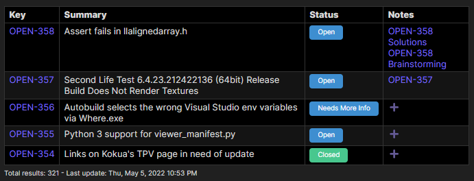
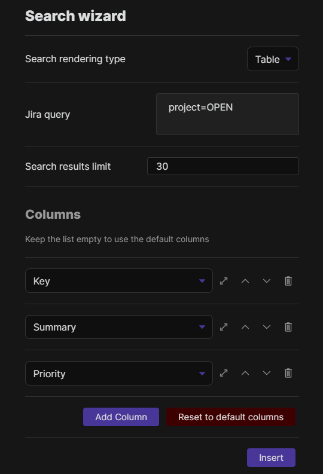

# Obsidian jira-issue

This plugin allows you to track the progress of [Atlassian Jira](https://www.atlassian.com/software/jira) issues from your [Obsidian](https://obsidian.md/) notes.

<!-- TOC -->

- [Obsidian jira-issue](#obsidian-jira-issue)
    - [Installation](#installation)
    - [Configuration](#configuration)
    - [Markdown Syntax](#markdown-syntax)
        - [📃`jira-issue`](#jira-issue)
        - [🔎`jira-search`](#jira-search)
        - [🔢`jira-count`](#jira-count)
    - [Available Columns](#available-columns)
    - [Link notes to `jira-search` table](#link-notes-to-jira-search-table)
    - [Inline issues](#inline-issues)
    - [Commands](#commands)

<!-- /TOC -->


## Installation
From the obsidian app go in `Settings > Third-party plugins > Community Plugins > Browse` and search for `jira-issue`.

## Configuration

Use the plugin options to configure the connection to your company Atlassian Jira server: host, username and password.

There are three authentication methods:

- Open: used for server without authentication.
- [Basic](https://datatracker.ietf.org/doc/html/rfc7617): username and password are used to login in your server.
  - Note for Jira Cloud instances this will be your email address and an API token.  API tokens can be generated in Jira Cloud from `Account Settings > Security > Create and manage API tokens`
- [Bearer](https://datatracker.ietf.org/doc/html/rfc6750): a token is used to login in your server.

This plugin stores your credentials in clear in the configuration file of this plugin.

## Markdown Syntax

### 📃`jira-issue`
Use the `jira-issue` fence to track issues:

    ```jira-issue
    AAA-111
    AAA-222
    https://my.jira-server.com/browse/BBB-333
    # This is a comment
    ```

### 🔎`jira-search`
Use the `jira-search` fence to perform JQL queries:

    ```jira-search
    resolution = Unresolved AND assignee = currentUser() AND status = 'In Progress' order by priority DESC
    ```

You can customize the output in the settings or directly in the fence using the following keywords:

| Keyword | Description | Default | Values |
| :- | :- | :- | :- |
| `type` | Rendering mode of the search results | `TABLE` | `TABLE` or `LIST` |
| `query` | Query to use with Jira to retrieve the results |  |  |
| `limit` | Maximum number of items to display | Use value from settings | Integer number |
| `columns` | List of columns to render ([Available columns](#available-columns)) | Use value from settings | Comma separated list |

Example:

    ```jira-search
    type: TABLE
    query: status = 'In Progress' order by priority DESC
    limit: 15
    columns: KEY, SUMMARY, #ASSIGNEE, #REPORTER, STATUS
    ```

### 🔢`jira-count`
Use the `jira-count` fence to perform JQL queries and display the number of results:

    ```jira-count
    project = REF AND status changed to (Done, "Won't Fix", Archived, "Can't Reproduce", "PM Validated") after -14d
    ```

## Available Columns

Available columns extracted from the Jira issue:

    KEY, SUMMARY, TYPE, CREATED, UPDATED, REPORTER, ASSIGNEE, PRIORITY, STATUS, DUE_DATE, RESOLUTION, RESOLUTION_DATE, PROJECT, ENVIRONMENT, LABELS, FIX_VERSIONS, COMPONENTS, AGGREGATE_TIME_ESTIMATE, AGGREGATE_TIME_ORIGINAL_ESTIMATE, AGGREGATE_TIME_SPENT, TIME_ESTIMATE, TIME_ORIGINAL_ESTIMATE, TIME_SPENT, AGGREGATE_PROGRESS, PROGRESS

- Columns names are case insensitive.
- If the column starts with `#`, the compact mode is used.

Example:

    ```jira-search
    query: key = OPEN-357
    columns: key, #key, type, #type, reporter, #reporter, created, #created
    ```


## Link notes to `jira-search` table

The special column `NOTES` can be used with `jira-search` tables to create a column that shows all the notes that start with the issue key.

Example:

    ```jira-search
    query: key = OPEN-357
    columns: key, summary, status, notes
    ```



## Inline issues
This plugin allows you to detect inline issue and render them inside your text without creating a dedicated fence block. In the settings it is possible to configure the prefix used to identify inline issues and if you want to render url to issues.

Example:

    With inline issue you can insert an issue like JIRA:OPEN-351 inside your text. The plugin will detect urls like https://jira.secondlife.com/browse/OPEN-352 and render the issue as tags.
    - [ ] Issue can be extended JIRA:OPEN-353 with the summary
    - [ ] Or compact JIRA:#OPEN-354 without the summary
    - [ ] JIRA:#OPEN-355 use the `#` symbol before the issue key to make it compact
    ```
    The plugin searches inside the note for those patterns and replace them
    JIRA:#OPEN-356
    ```


## Commands

- Insert fence template: insert at the cursor position, the jira-issue fence block.
- Clear cache: clear cached issues before the expiration time to download them again.
- Search wizard: open the search wizard modal to help you to create a search query:


